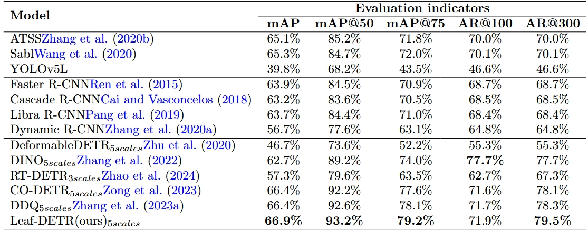

**Leaf-Detr**: Progressive Adaptive Network with Lower Matching Cost for Dense Leaves Detection


Leaves are the most important plant organs, and monitoring leaves is a     crucial aspect of crop surveillance. Dense leaf detection plays an important role as a fundamental technology for leaf monitoring.
The methods for dense leaf detection generally use traditional modular detectors and general feature extraction techniques, without designing methods specifically for dense leaves in reality.
In detail, in complex field scenarios, it still faces challenges like incomplete individual feature extraction due to high leaf overlap and difficult network convergence caused by excessive leaf density. To this end, we propose the Leaf-DETR framework, which effectively addresses these challenges through the Progressive Feature Fusion Pyramid Network (P-FPN) and the Crowded Query Refinement Strategy (CQR). First, we construct the largest dense leaf detection dataset to date, containing 1,696 images and 85,375 annotation boxes. Second, P-FPN alleviates the feature confusion problem of overlapping leaves through the multi-stage fusion of features and the Adaptive Feature Aggregation module (AFA), enhancing the interaction between low-level details and high-level semantics. Third, the CQR strategy significantly reduces the matching cost of crowded candidate boxes and improves the network convergence efficiency by culling a crowded query method and introducing a one-to-many matching mechanism. Finally, experiments show that Leaf-DETR outperforms existing detection methods on the self-built dataset and demonstrates good performance generalization in monitoring collected images, as well as for other staple food crops, which verifies its practicality in complex agricultural scenarios.


Figure 1: The overall framework of Leaf-DETR. It is equipped with P-FPN, CQR strategy and the improved JTAH. Through the extraction of discriminative features by P-FPN and the efficient training process equipped with CQR, the model is able to possess a powerful dense leaf detection capability.

**P-FPN: Progressive Feature Fusion Pyramid Network**


Figure 2: Framework of Progressive Feature Pyramid Network. (a) Progressive architecture: information interaction is achieved through progressive feature fusion of adjacent levels.(b) Adaptive Feature Aggregation: it realizes feature fusion using a dual-path approach. The progressive feature fusion path and the dual-path feature fusion method can extract more discriminative leaf features.

**CQR: Crowded Query Refinement Strategy**
We adopt a one-to-many matching mechanism during training, combined with NMS to select the optimal detection results. This strategy effectively improves training efficiency and sample utilization, while maintaining model lightweightness, and enhances the robustness of detecting dense, occluded, or small-sized leaves.

**JTAH: Improved Jointly Trained Auxiliary Head**
We introduce the improved Jointly Trained Auxiliary Head. Referring to the design of CQR, we discard the confidence values in the auxiliary head and instead assign randomized confidence values to each sample and use NMS to suppress the overlapping samples.


**Leaf-Detr**: Progressive Adaptive Network with Lower Matching Cost for Dense Leaves Detection

---
**Introduction**

To detect the dense leaves in the field, we propose the Leaf-DETR dense leaf detection framework, which includes the Progressive Feature Pyramid Network with a progressive framework, the Jointly Trained Auxiliary Head, and the Crowded Query Refinement strategy. As shown in Fig. \ref{fig:leafdetr}, the input leaf image first undergoes preliminary feature extraction by the backbone. Subsequently, the multi-scale features extracted from the backbone further interact and fuse in the P-FPN, which enhances the distinguishability between individual leaves and adjacent leaves. Furthermore, these enhanced features are uniformly encoded by the encoder and then transmitted to the decoder and the jointly trained auxiliary head. The decoder receives information from both the encoder and the auxiliary head simultaneously to expand the training samples. It is equipped with a crowded query refinement strategy to mitigate the adverse effects caused by leaf overlap. Finally, the output results will retain the bounding boxes of both the intact leaves and the occluded leaves.

**Dependencies**

-  Python 3.7
-  torch 1.11.0
-  cuda 11.3
-  Numpy 1.19.0
-  torchvision 0.12.0
-  mmcv-full 1.5.0
-  Install MMDetection locally
```python
pip install -v -e .
```
**GitHub**: https://github.com/1345149799/Leaf-DETR

**Dataset**

The largest dataset for dense leaf detection has been created, which includes 1,696 images of dense kiwifruit leaves, with a total of 85,375 target objects. Each image has a high resolution of six million pixels and contains detailed phenotypic characteristics of kiwifruit leaves.
The code can be downloaded from [here](https://github.com/1345149799/Leaf-DETR). The datasets of Dense kiwifruit leaf detection dataset can be download from [here](https://plantmulti-1302037000.cos.ap-chengdu.myqcloud.com/upload/dense_kiwifruit_leaf.zip).Download the dataset to the './data' folder and renamed it as 'kiwifruitleaf'.

**Pre-trained models**

The pre-trained Leaf-DETR model are uploaded. You can download [it](),and download them to the './weight' folder.

**Get started**

**Train**
```python
python tools/train.py ./projects/configs/leafdetr/leafdetr_r50_pfpn_1x_coco.py
--work-dir workdir/leafdetr
```

**Test**
```python
python tools/test.py ./projects/configs/leafdetr/leafdetr_r50_pfpn_1x_coco.py
--work-dir workdir/leafdetr
```

**Results**

**Comparative experiment**



Table 1: Comparison of the different object detection models on kiwifruit leaf detection. According to the horizontal line, it is divided
into single-stage detectors, two-stage detectors and end-to-end detectors. The indicators of Leaf-DETR outperform those of existing object
detectors, confirming its powerful dense leaf detection capability.

**Visualization comparison**


Figure 3: Visualization comparison. (a)Select the image area with dense leaves, (b) SABL, (c) Faster R-CNN, (d) DDQ, (e) Leaf-DETR. The
yellow boxes indicate undetected leaves. The yellow boxes represent the undetected leaves, and Leaf-DETR achieves comprehensive detection.
The yellow boxes represent the undetected leaves. Compared with other models, Leaf-DETR has no cases of missed detection, confirming its
superior detection coverage.

**About Leaf-DETR**
---
---
**Why Leaf-Detr?**

Crop growth monitoring is crucial for sustainable agricultural production, as it enables the timely detection and resolution of issues affecting crop health and yield, thereby optimizing resource allocation and enhancing production efficiency. Leaves, being the primary photosynthetic organs, play a pivotal role in this ecosystem by absorbing sunlight, carbon dioxide, and water to synthesize organic compounds essential for plant development. Consequently, monitoring leaf characteristics is indispensable for assessing the overall crop health status. As shown in Figure 1, by combining advanced object detection techniques with downstream tasks to monitor leaves, it is possible to provide comprehensive information regarding leaf distribution, health status, and growth trajectories in complex agricultural environments where there is widespread leaf overlap and plant structures form complex visual patterns. Among them, the dense object detection technology is extremely important for achieving the detection of dense leaves, as the foundation for downstream applications.


Figure 4: Motivation of leaf-deter. (a) The importance of leaves and the role of detecting leaves. (b) Differences in the DETRs architecture, Leaf-DETR has higher attention to the leaf edges and lower matching cost.

**Our pipeline**


Figure 5: Schematic diagram of kiwifruit leaf Data collection and application. (a) Data collection: Using UAV for high-altitude aerial imaging, (b) Image annotation: Through image screening, cropping, manual annotation, and AI-assisted annotation, (c) Model architecture: The proposed Leaf-DETR framework is equipped with P-FPN, CQR strategy, and the improved JTAH, (d) Agricultural application: Real-time leaf data is acquired through deployed cameras, enabling various downstream applications.
